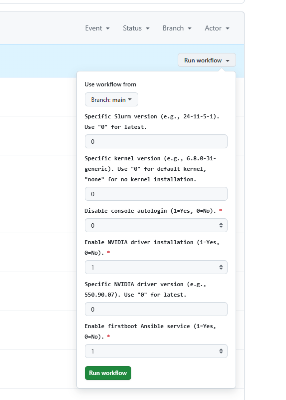

# Warewulf Slurmd Node Image

[](https://github.com/ualberta-rcg/warewulf-slurmd/actions/workflows/deploy-warewulf-slurmd.yml)

[](./LICENSE)

**Maintained by:** Rahim Khoja ([khoja1@ualberta.ca](mailto:khoja1@ualberta.ca)) & Karim Ali ([kali2@ualberta.ca](mailto:kali2@ualberta.ca))

## 🧰 Description

This repository contains a hardened **Slurm compute node image** based on Ubuntu 24.04, built into a Docker container that is **Warewulf-compatible** and deployable on bare metal.

It's primarily used for imaging and provisioning Slurm compute nodes using [Warewulf 4](https://warewulf.org) in high-performance computing clusters. The image includes the full Slurm daemon stack and CIS security hardening using the SCAP Security Guide.

The image is automatically built and pushed to Docker Hub using GitHub Actions whenever changes are pushed to the `latest` branch.

## 📦 Docker Image

**Docker Hub:** [rkhoja/warewulf-slurmd:latest](https://hub.docker.com/r/rkhoja/warewulf-slurmd)

```bash
docker pull rkhoja/warewulf-slurmd:latest
```

## 🏗️ What's Inside

This container includes:

* **Slurm 24.11+** (installed from custom DEB packages)
* **Slurm daemon** (`slurmd`) and client tools
* **Optional kernel installation** with configurable version
* **Optional NVIDIA driver support** (requires kernel installation)
* SSH, networking tools, monitoring utilities, debugging tools
* SCAP CIS Level 2 hardening (automatically applied)
* Systemd-based boot compatible with Warewulf PXE deployments
* Pre-created `wwuser` (UID/GID 1001) and `slurm` (UID/GID 999) users
* `changeme` root password (change in production!)

**Slurm** ([docs](https://slurm.schedmd.com/)) is ready for integration with existing Slurm clusters.

## 🚀 Build Options

The image supports several build-time configurations:

### **Kernel Installation**
- **With Kernel** (default): Installs specific Linux kernel version with headers and modules
- **No Kernel**: Skips kernel installation for use with host kernel or different kernel management

### **NVIDIA Support**
- **Enabled**: Installs NVIDIA drivers (requires kernel installation)
- **Disabled**: No NVIDIA components (faster builds, smaller images)

### **Slurm Version**
- **Latest**: Automatically detects and uses latest stable Slurm release
- **Specific**: Override with exact version (e.g., `24-11-6-1`)

### **Autologin & Firstboot**
- **Console Autologin**: Optional root autologin for debugging
- **Firstboot Service**: Optional Ansible playbook execution on first boot

## 🏷️ Docker Tags

Images are tagged with a descriptive naming scheme:

**With Kernel + NVIDIA:**
```bash
u24-6.8.0-31-slurm-24.11.6-1-nv570.148
# Ubuntu 24.04 + Kernel 6.8.0-31 + Slurm 24.11.6-1 + NVIDIA 570.148
```

**With Kernel Only:**
```bash
u24-6.8.0-31-slurm-24.11.6-1
# Ubuntu 24.04 + Kernel 6.8.0-31 + Slurm 24.11.6-1
```

**No Kernel:**
```bash
slurm-24.11.6-1
# Slurm 24.11.6-1 only (no kernel, no NVIDIA)
```

## 🛠️ GitHub Actions - CI/CD Pipeline

This project includes a GitHub Actions workflow: `.github/workflows/deploy-warewulf-slurmd.yml`.

### 🔄 What It Does

* Builds the Docker image from the `Dockerfile` with configurable options
* Automatically detects latest Slurm and kernel versions
* Generates appropriate Docker tags based on configuration
* Logs into Docker Hub using stored GitHub Secrets
* Pushes the image with descriptive tagging

### 🎛️ Build Configuration Options

The GitHub Actions workflow provides several build-time options that you can configure when manually triggering the build:



**Available Options:**
- **Kernel Installation**: Choose whether to include a specific Linux kernel
- **NVIDIA Support**: Enable/disable NVIDIA driver installation
- **Slurm Version**: Select specific Slurm version or use latest
- **Console Autologin**: Enable root autologin for debugging
- **Firstboot Service**: Enable Ansible playbook execution on first boot

### 🍴 Forking for Custom Versions

**Important:** If you want to customize this image for your own environment or requirements, please **fork this repository** rather than using it directly. This allows you to:

- Modify build parameters for your specific needs
- Add custom packages or configurations
- Maintain your own version control
- Customize the CI/CD pipeline for your infrastructure

Most of the information needed to get started is already documented in this README, including the required GitHub Secrets setup and workflow configuration.

### ✅ Setting Up GitHub Secrets

To enable pushing to your Docker Hub:

1. Go to your fork's GitHub repo → **Settings** → **Secrets and variables** → **Actions**
2. Add the following:

   * `DOCKER_HUB_REPO` → your Docker Hub repo. In this case: *rkhoja/warewulf-slurmd*
   * `DOCKER_HUB_USER` → your Docker Hub username
   * `DOCKER_HUB_TOKEN` → create a [Docker Hub access token](https://hub.docker.com/settings/security)

### 🚀 Manual Trigger & Auto-Build

* **Manual**: Run the workflow from the **Actions** tab with **Run workflow** (enabled via `workflow_dispatch`)
* **Automatic**: Any push to the `latest` branch triggers the CI/CD pipeline

**Recommended branching model:**
```bash
git checkout latest
git merge main
git push origin latest
```

## 🧪 How To Use This Image with Warewulf 4

Once you have Warewulf 4 setup on your control node:

```bash
# Import with kernel and NVIDIA support
wwctl image import --build --force docker://rkhoja/warewulf-slurmd:u24-6.8.0-31-slurm-24.11.6-1-nv570.148 slurmd-gpu

# Import with kernel only (no NVIDIA)
wwctl image import --build --force docker://rkhoja/warewulf-slurmd:u24-6.8.0-31-slurm-24.11.6-1 slurmd-cpu

# Import without kernel (use host kernel)
wwctl image import --build --force docker://rkhoja/warewulf-slurmd:slurm-24.11.6-1 slurmd-minimal
```

### Warewulf Configuration

The image includes a firstboot service that can run Ansible playbooks for post-deployment configuration. Place your playbooks in `/etc/ansible/playbooks/*.yaml` on the deployed nodes.

## 🤝 Support

Many Bothans died to bring us this information. This project is provided as-is, but reasonable questions may be answered based on my coffee intake or mood. ;)

Feel free to open an issue or email **[khoja1@ualberta.ca](mailto:khoja1@ualberta.ca)** or **[kali2@ualberta.ca](mailto:kali2@ualberta.ca)** for U of A related deployments.

## 📜 License

This project is released under the **MIT License** - one of the most permissive open-source licenses available.

**What this means:**
- ✅ Use it for anything (personal, commercial, whatever)
- ✅ Modify it however you want
- ✅ Distribute it freely
- ✅ Include it in proprietary software

**The only requirement:** Keep the copyright notice somewhere in your project.

That's it! No other strings attached. The MIT License is trusted by major projects worldwide and removes virtually all legal barriers to using this code.

**Full license text:** [MIT License](./LICENSE)

## 🧠 About University of Alberta Research Computing

The [Research Computing Group](https://www.ualberta.ca/en/information-services-and-technology/research-computing/index.html) supports high-performance computing, data-intensive research, and advanced infrastructure for researchers at the University of Alberta and across Canada.

We help design and operate compute environments that power innovation — from AI training clusters to national research infrastructure.

